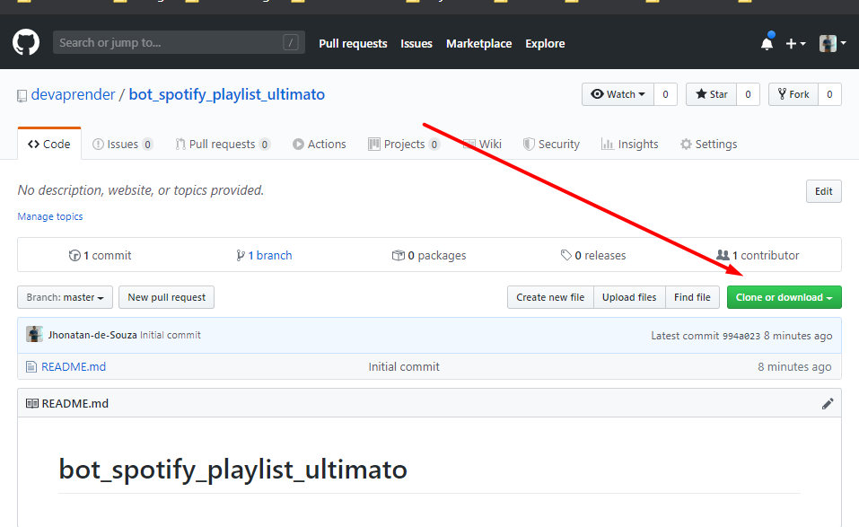
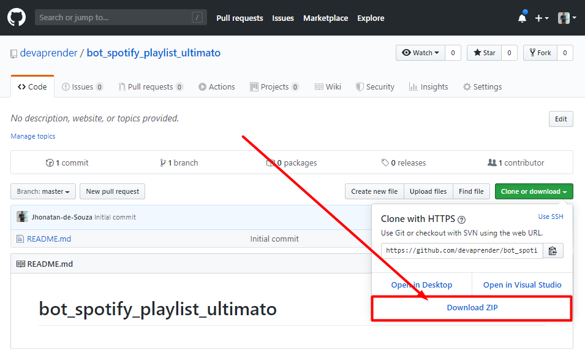

# Bem vindo! Instruções de como usar este script:

 - Se já usou o github antes já deve saber como fazer o download deste arquivo.
 - Se você nunca usou o GitHub(este site) antes, veja o que fazer abaixo

# Como baixar os arquivos

1. Clique no botão verde para fazer o download

2. Clique em Download ZIP

---

# Como usar estes arquivos

1. Após ter feito o download dos arquivos vá até a pasta onde você fez o download e extraia o arquivo.
2. Altere a mensagem que deseja enviar para cada grupo de acordo com o que foi [instruído no vídeo](https://www.youtube.com/watch?v=ISYHWfWvp3E&t=307s), veja o vídeo novamente [clicando aqui](https://www.youtube.com/watch?v=ISYHWfWvp3E&t=307s).
3. Altere o nome do grupos para os quais quer enviar a mensagem de acordo com o que foi [instruído no vídeo](https://www.youtube.com/watch?v=ISYHWfWvp3E&t=307s), veja o vídeo novamente [clicando aqui](https://www.youtube.com/watch?v=ISYHWfWvp3E&t=307s).
---

# Imagine se você pudesse:

* **Criar robôs** que trabalham por você?
* **Usar** a programação ao seu favor?
* **Economizar** dezenas de horas?
* **Monetizar** seu conhecimento?

Vou te ensinar tudo isso [neste curso](https://cursodevaprender.getresponsepages.com/), saiba mais [clicando aqui](https://cursodevaprender.getresponsepages.com/).

---

## Tem sugestões/temas/tópicos/cursos para o canal?
Estou sempre aberto para sugestões, mande elas para jhonatan@devaprender.com